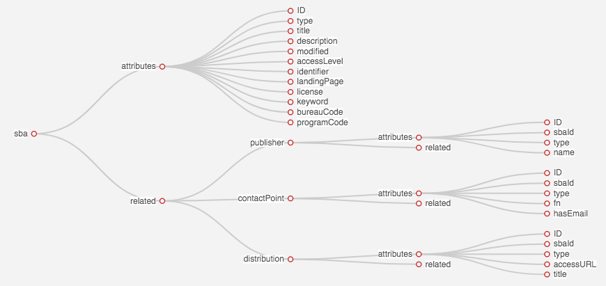

# JSON object to PostgreSQL

Evaluation of three different parts.

- JSON object to ontology
- Ontology to PostgreSQL schema
- Postgraphile API

## Context

A JSON object (open data by different providers) will be loaded. This Object should be parsed
into an ontology. This can, later on, be used to generate a PostgreSQL schema.
On top of the created PostgreSQL schema is a query interface needed, which can be solved by Postgraphile.

# Evaluation - From JSON to Graphql API

## Prerequisites

### Installation

`npm i`

### PostgreSQL

A PostgreSQL installation is mandatory for this project.

Visit [here](https://www.postgresql.org/docs/12/installation.html) to get infromations for the installation of PostgreSQL.

The project uses mainly all environment variables. The only exception is the database. Therefore a database needs to be created to ensure the usability of the project.

### Postgraphile API

`npm install -g postgraphile`

---

## Ontology schema

### 1. JSON schema

The following shows the desired JSON representation for the ontology :
<br/>

```JSON
{
  "name": "example_root",
  "children": [
    {
      "name": "attributes",
      "children": [
        { "name": "ID", "value": "number" },
        { "name": "uuid", "value": "string" },
        { "name": "number", "value": "string" },
      ]
    },
    {
      "name": "related",
      "children": [
        {
          "name": "example_related",
          "children": [
            {
              "name": "attributes",
              "children": [
                { "name": "ID", "value": "number" },
                { "name": "example_rootId", "value": "number" },
              ]
            },
            { "name": "related", "children": [] }
          ]
        }
      ]
    }
  ]
}

```

### 2. Visualization

To visualize the JSON ontology a library called Echarts has been used.
<br/>



# Implementation

## main.js

```javascript
function extractOntologyFromObject(rootNode, data)
```

A recursive function which iterates through the given data, where it creates an ontology as described above. Every new recursive call adds a node to the rootNode and will be treated as the new rootNode.

- rootNode: <br/>
  Is created by the function `generateRootNode` and contains the root node of the ontology object
- data: <br/>
  The current part of the JSON object

---

```javascript
function generateRootNode(rootName)
```

Generates a root node that is used later on in the `extractOntologyFromObject` function.

- rootName: <br/>
  Name of the root of the ontology object

Example root node:

```JSON
{
  "name": "example_root",
  "children": [
    {
      "name": "attributes",
      "children": [
        {
          "name": "ID",
          "value": "number"
        }
      ]
    },
    {
      "name": "related",
      "children": []
    }
  ]
}
```

---

```javascript
function ontologyToPGQuery(graph)
```

Returns a fully generated query based on the given ontology. In the first step, a schema is created by the name of the root node. From then the query gets completed by the function `createQuery`

- graph<br/>
  Ontology of a JSON schema.
  <br/>

---

```javascript
function createQuery(graph, schemaName, flag)
```

Recursive function to create 1..n tables from a given ontology. The Table is created with the current root node name. All columns of this table will be generated afterward. Here is also a foreign key defined if the right parameters are fulfilled. The recursive call comes into use when a related table needs to be created. Therefore this function is called with the related ontology as the new `graph` and `flag` incremented by one.

- graph<br/>
  Current root node used for the generation of the PostgreSQL query
- schemaName<br/>
  Schema name where the tables need to be created in
- flag<br/>
  Indicator of the depth of the recursion

## query.js

query.js is a Library offering functions to generate stepwise a query.

```javascript
 function CREATESCHEMA(schemaName)
```

Creates a schema with the name `schemaName`

---

```javascript
 function CREATETABLE(tableName, schemaName)
```

Creates a table with the name `tableName` within the schema `schemaName`

---

```javascript
 function ADDCOLUMN(columnName, type, flags = "")
```

Creates a column with the name `columnName` and the type `type`. Additionally, there can be attached more specific queries by `flag`, e.g. a foreign key

---

```javascript
 function ADDPRIMEKEY(columnName, tableName)
```

Creates a constraint as a primary key for the column named `columnName` inside the table `tableName`

---

```javascript
const typePG = {
  number: "INT",
  string: "text",
  "string[]": "text[]"
};
```

Currently supported data types.

# Usage

## Custom CLI

`node main.js <json_file> <database_name>`

However, arguments can contain the following values:

- json_file:
  - sba (loads the sba JSON file)
  - pegel (loads the pegel JSON file)
- database_name
  - the name of the database created in the prerequisites should be used here

## Postgraphile API

The following command starts the postgraphile API. As so a service starts on the port 5000 and can be accessed as an API at `http://localhost:5000/graphql`<br/>

`--enhance-graphiql` creates a better GUI for the postgraphile API which can be reached via `http://localhost:5000/graphiql`

---

`postgraphile -c "postgres:///<database_name>" --enhance-graphiql`

- database_name
- the name of the database created in the prerequisites should be used here
